# Final Report: Efficient Food-101 Classification with Transfer Learning, Error Analysis, and Deployment Optimization

## 1. Project Overview

This project studies an efficient image-classification pipeline for the `Food-101` dataset, with the goal of balancing recognition performance and deployment practicality. Following the roadmap, the work covers supervised training, two-stage transfer learning, data-loading efficiency analysis, model interpretability with Grad-CAM, and deployment-oriented optimization through pruning, ONNX export, and static quantization.

The final system is built around `MobileNetV3-Large` pretrained on ImageNet. This backbone was selected because it offers a strong accuracy-efficiency trade-off compared with heavier architectures. The dataset contains `101` food categories. For model development, the official training split was further divided into a stratified training set (`60,600` images) and validation set (`15,150` images), while the official test split (`25,250` images) was kept untouched for final evaluation.

## 2. Method

### 2.1 Training Pipeline

The training pipeline was implemented in `PyTorch Lightning` to keep experiments reproducible and modular. All experiments used the same core setup: `CrossEntropyLoss`, `AdamW`, and `ReduceLROnPlateau`. Standard ImageNet-compatible preprocessing and augmentation were applied so the pretrained backbone could be reused without mismatch.

Three training regimes were compared:

| Model setting | Description | Best validation accuracy |
| --- | --- | ---: |
| Baseline | Fine-tune the full `MobileNetV3-Large` model from the start | `0.7325` |
| Stage 1 | Freeze the backbone and train only the classifier head | `0.5966` |
| Stage 2 | Unfreeze deeper feature blocks and fine-tune with a smaller learning rate | `0.7836` |

The Stage 2 model was selected as the final training result because it clearly outperformed both the baseline and the head-only transfer-learning stage.

**Baseline training curves**

  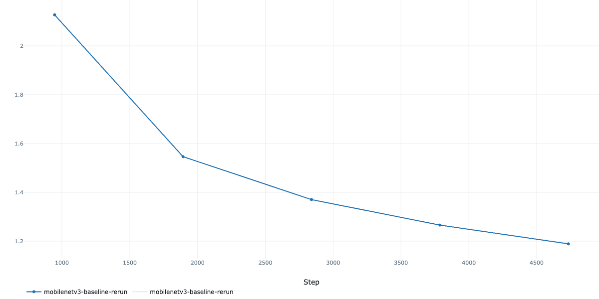
  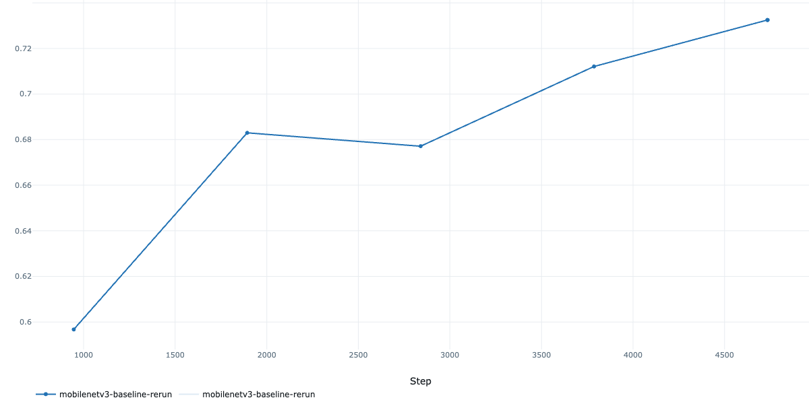

**Final Stage 2 training curves**

  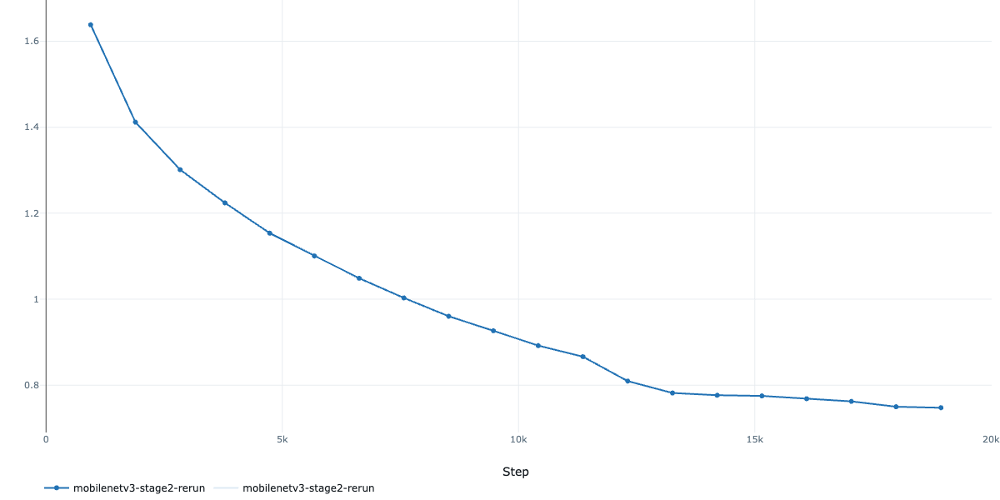
  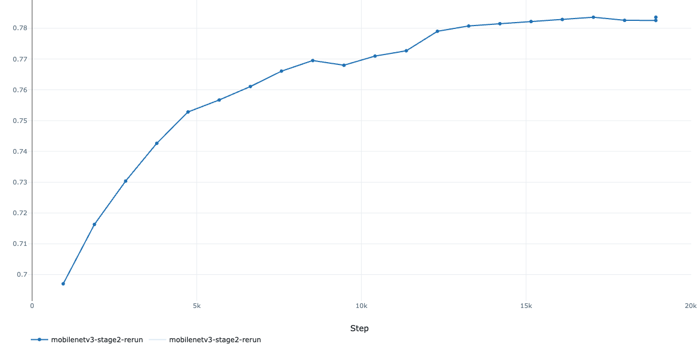

### 2.2 Efficiency Analysis

To improve training throughput on the local environment, several `DataLoader` settings were benchmarked. The best settings were:

| Parameter | Tested values | Best choice | Average epoch time |
| --- | --- | --- | ---: |
| `num_workers` | `0, 2, 4, 8` | `4` | `65.25 ms` |
| `batch_size` | `32, 64, 128, 256` | `32` | `66.83 ms` |
| `pin_memory` | `False, True` | `False` | `71.08 ms` |
| `prefetch_factor` | `2, 4, 6, 8` | `2` | `67.27 ms` |

These results show that efficiency tuning is strongly hardware-dependent. In this project, more aggressive settings did not automatically improve throughput, so the final pipeline kept the simpler and more stable configuration.

  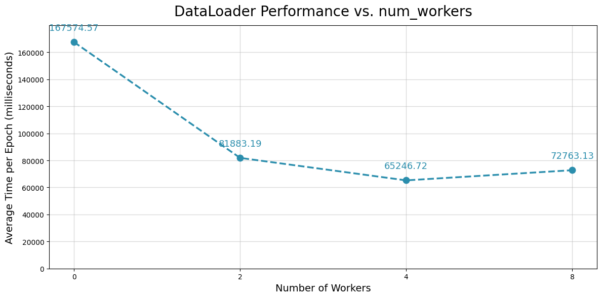
  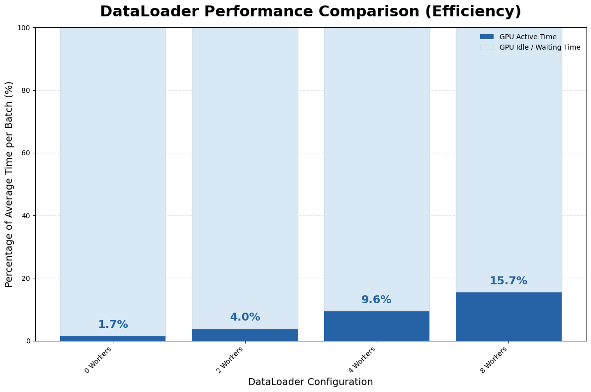
  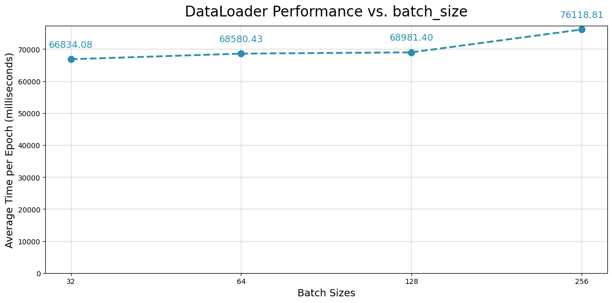

  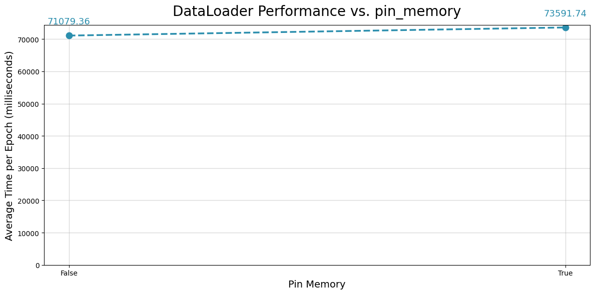
  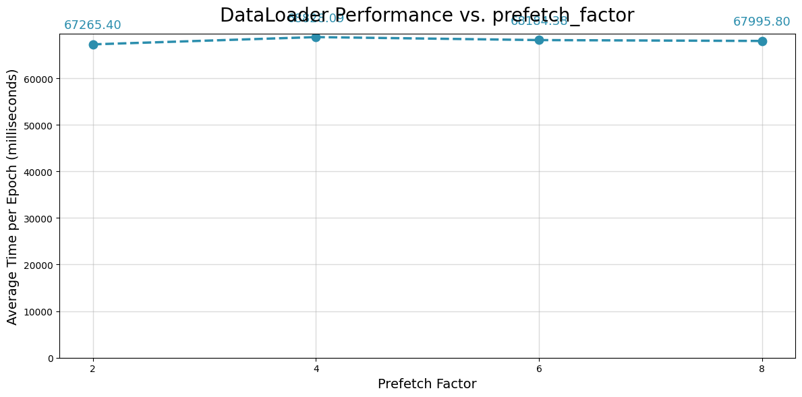

### 2.3 Error Analysis with Grad-CAM

After training, the best Stage 2 checkpoint was inspected qualitatively using `Grad-CAM`. Correct and incorrect predictions from the test set were visualized to understand whether the model focused on the food item itself or on distracting context such as plates, background textures, or visually similar ingredients. The heatmaps indicate that the model usually attends to the main dish region on correct predictions, while several mistakes are associated with ambiguous presentation and class similarity.

  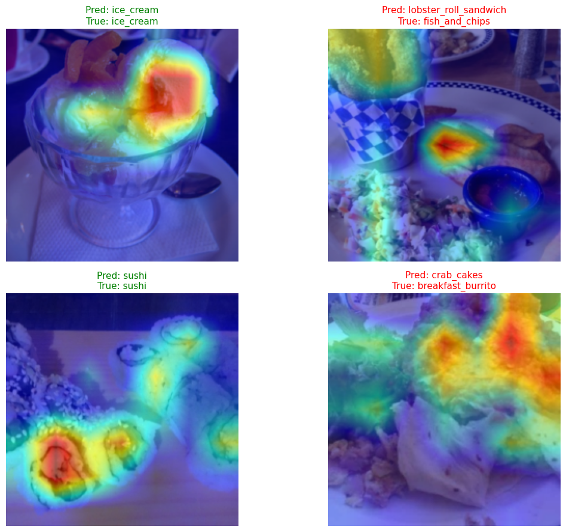

### 2.4 Deployment Optimization

Two deployment-oriented optimization directions were tested.

First, a cautious structured pruning pass was applied only to a small number of late pointwise convolution layers. This reduced model quality without improving inference speed enough to justify deployment:

| Setting | Accuracy | Latency per batch |
| --- | ---: | ---: |
| Original Stage 2 PyTorch model | `0.8276` | `0.0191 s` |
| Pruned model | `0.7806` | `0.0197 s` |

Because pruning caused a noticeable accuracy drop and slightly worse latency (`0.97x`, effectively no speedup), it was not selected.

Second, the final Stage 2 model was exported to ONNX and tested with static INT8 quantization in `ONNX Runtime`. Several selective quantization candidates were compared, and the best final choice was `MatMul + Gemm Only`.

| Artifact | Model size (MB) | Inference latency (ms) | Accuracy (%) |
| --- | ---: | ---: | ---: |
| Baseline ONNX (FP32) | `16.85` | `69.91` | `82.764` |
| Selected INT8 ONNX | `12.95` | `68.99` | `82.745` |

This quantized artifact reduced model size by about `23%` with only a negligible accuracy change (`-0.020` percentage points). The latency improvement was small but positive, so quantization was retained as the preferred deployment optimization.

## 3. Final Results

### 3.1 Test Accuracy

The final selected Stage 2 model achieved about `82.76%` accuracy on the held-out test set. This is the main headline result of the project and confirms that the two-stage fine-tuning strategy generalized well beyond the validation split.

  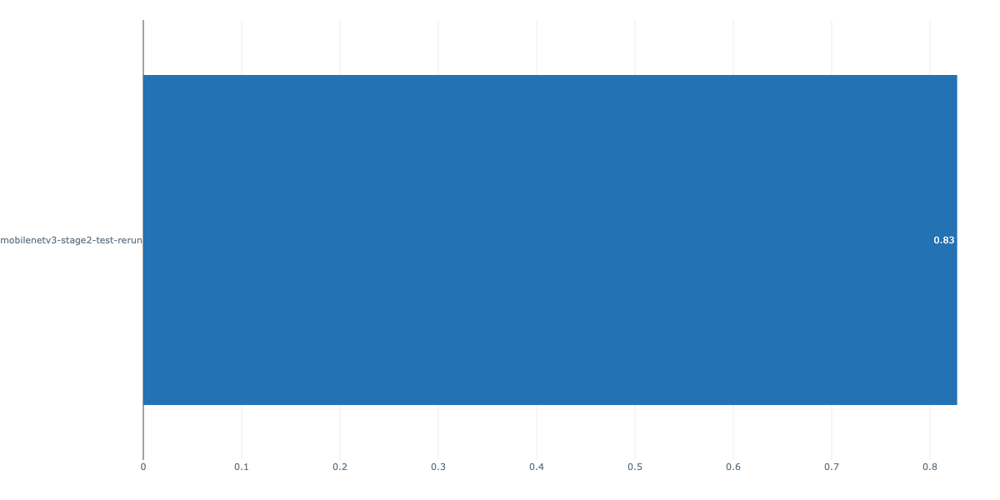

### 3.2 Qualitative Predictions

Qualitative validation predictions show that the final model is able to correctly classify many visually diverse dishes with strong confidence. These examples complement the quantitative test metrics by showing that the model remains robust across different dish appearances, backgrounds, and presentation styles.

  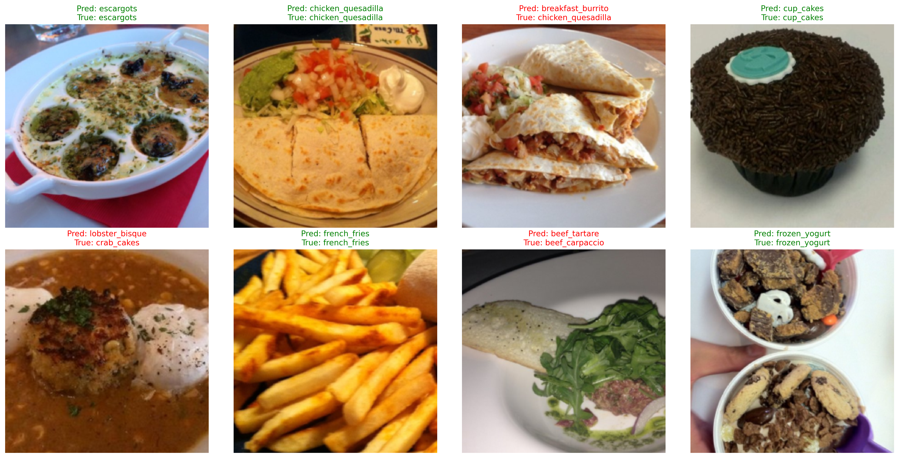

（The answer was quite unexpected and made me laugh for a long time, but seriously, I still agree with dataset's label: Thomas looks more like a hot dog 🌭）

### 3.3 Final Interpretation

The main outcome of the project is that a lightweight pretrained backbone can achieve strong `Food-101` performance when combined with a careful transfer-learning schedule. Training only the classifier head was not sufficient, but selective late-stage fine-tuning improved validation accuracy from `0.5966` to `0.7836`. The final selected model remained suitable for deployment after ONNX export and static quantization.

From an engineering perspective, the project also shows that deployment optimizations must be validated empirically. In this case, structured pruning was not worthwhile, while selective INT8 quantization preserved accuracy much more effectively. This supports the final decision to prefer the quantized ONNX artifact over the pruned PyTorch model.

## 4. Deployment Demo

The final ONNX artifact was also tested through an end-to-end inference demo. This step confirms that the exported deployment model can load correctly and produce readable predictions on real images, rather than only performing well in metric tables.

  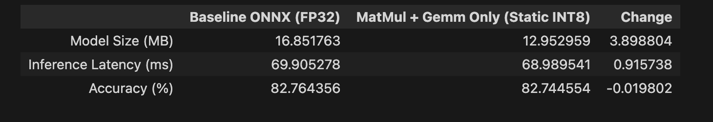

## 5. Conclusion

Overall, the roadmap objectives were completed with a coherent end-to-end computer vision pipeline: dataset inspection, reproducible training, two-stage transfer learning, throughput analysis, interpretability, and deployment preparation. The final recommendation is to use the Stage 2 `MobileNetV3-Large` checkpoint as the main model and the selected static INT8 ONNX artifact as the deployment candidate.

Future improvements could focus on integrating the trained and exported model into an iOS application, so the project can move from notebook-based experimentation to an end-user mobile deployment setting. A practical next step would be to validate the ONNX or converted mobile-ready model directly on device and measure real latency, memory usage, and user experience in an iPhone-based inference workflow.
